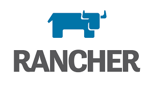

  

<h3 align="center">RANCHER</h3>

 

---

 Todas as aplicacoes com Rancher
      

## 📝 SUMARIO
 

1. [JENKINS versao BITNAMI](./jenkins-bitnami/README.md)
 

2. [JENKINS versao OFICIAL](./jenkins-jenkins/README.md)

 

 

## 🧐 OPCOES 

Clique no menu acima e veja as opcoes.

 

 

  

