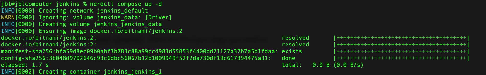
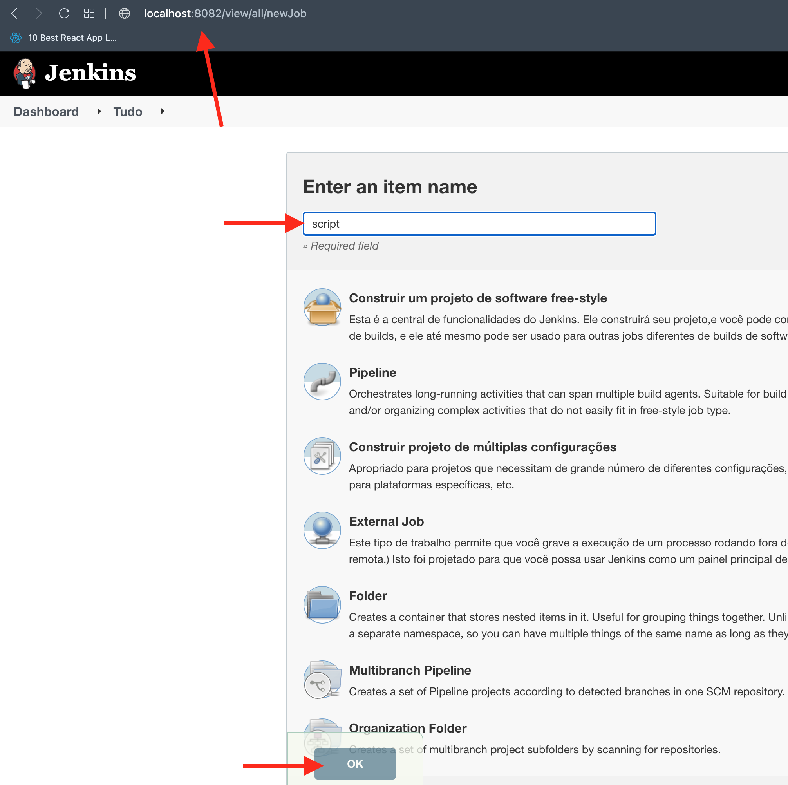

# Versao do Jenkins pela Bitnami

## SUMARIO

- [PASSO A PASSO](#passos)
- [JENKINS](#jenkins)
- [COMANDOS RANCHER](#comandos-rancher)
- [LINKS](#links)

</br>

## PASSO A PASSO <a name = "passos"></a>

1. Baixe o respositorio
2. Entre na pasta rancher/jenkins

```
nerdctl pull bitnami/jenkins

nerdctl compose up -d

```

<p align="center">
  <a href="" rel="noopener">
 </a>
</p>


Entre no browser com a url:  http://localhost:8082

user: user

pass: bitnami

</br>

</br>

## JENKINS <a name = "jenkins"></a>

1. Entre no jenkins
2. Copie o conteudo do arquivo ```provision_jenkins.sh```
3. Execute o Job 

<p align="center">
  <a href="" rel="noopener">
 </a>
</p>

</br>

## COMANDOS RANCHER <a name = "comandos-rancher"></a>


### Entrar como Root no POD do RANCHER do JENKINS

```

# nerdctl exec -u root -it <nome-do-container>  /bin/bash

```

 Exemplo:  
 ```

# nerdctl exec -u root -it jenkins_jenkins_1  /bin/bash

 ```


</br>

## Links <a name = "links"></a>

Projeto da build do Jenkins Bitnami
* https://hub.docker.com/r/bitnami/jenkins *