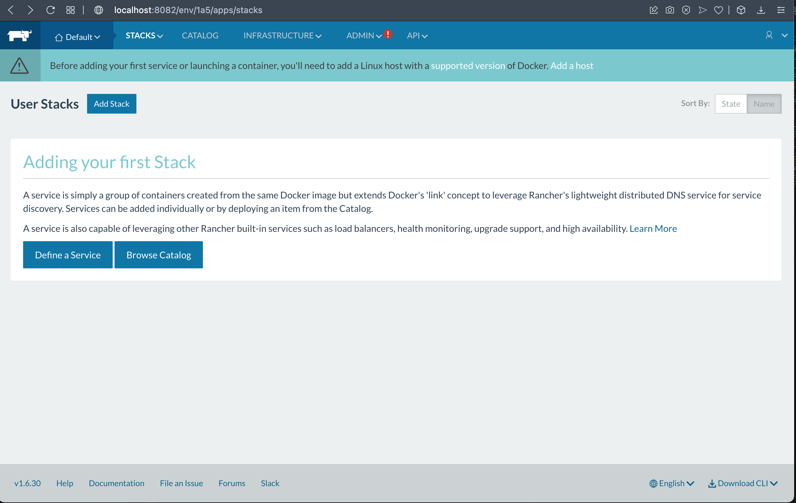
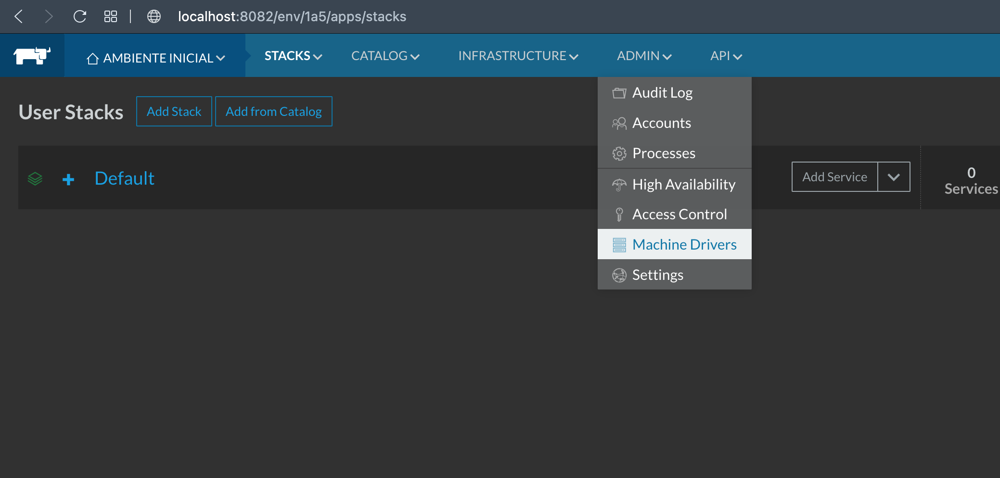
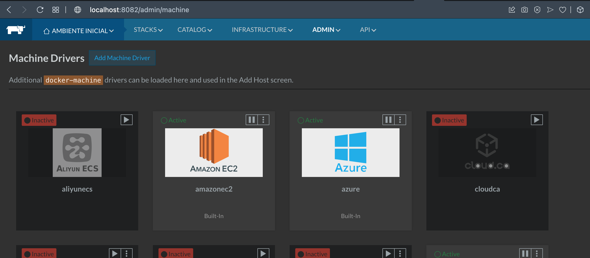
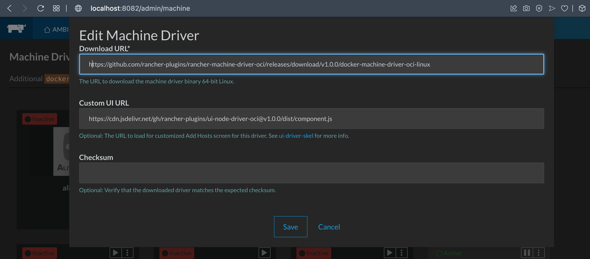
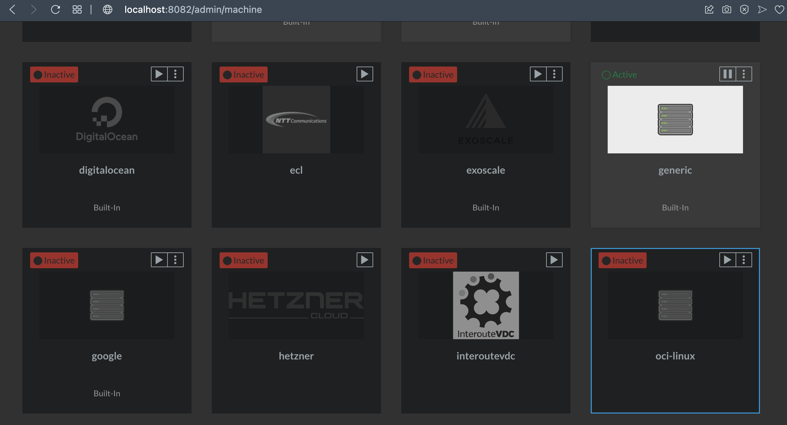
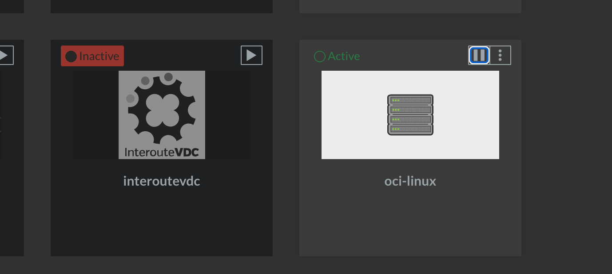

<p align="center">
  <a href="" rel="noopener">
 </a>
</p>

<h3 align="center">COMO INSTALAR o RANCHER SERVER NO RANCHER DESKTOP</h3>

<div align="center">

[]()
[](/LICENSE)

</div>

---

<p align="center"> Few lines describing your project.
    <br> 
</p>

## 📝 SUMARIO

- [SOBRE](#sobre)
- [INSTALACAO](#instalacao)


## 🧐 About <a name = "about"></a>

Aqui vamos utilizar o NERDCTL do RANCHER DESKTOP

## 🏁 INSTALACAO <a name = "instalacao"></a>

1. Rodar o comando ```nerdctl run -d --restart=unless-stopped -p 8080:8080 rancher/server```

2. Aguardar, apos o termino, 2 min para dar tempo pra subir o rancher server

### Instalacao do Rancher Server


```
nerdctl run -d --restart=unless-stopped -p 8080:8080 rancher/server
```

No meu caso deu erro com a tag --restart entao eu fiz
```
  nerdctl run -d  -p 8082:8080 rancher/server
  nerdctl container ls
```

<p align="center">
  <a href="" rel="noopener">
 </a>
</p>


## 🧐 ADD OCI DRIVER no RANCHER 1.6 <a name = "about"></a>
##  Adding OCI Node Driver

</br>

### PORTUGUES 

Se o driver do nó OCI não estiver incluído como driver integrado:

* Adicione um driver de nó no Rancher (Global > Drivers de nó)
   * URL de download:
     `https://github.com/rancher-plugins/rancher-machine-driver-oci/releases/download/v1.0.0/docker-machine-driver-oci-linux`
   * URL da interface do usuário personalizada:
     `https://cdn.jsdelivr.net/gh/rancher-plugins/ui-node-driver-oci@v1.0.0/dist/component.js`
   * Domínios da lista de permissões:
     `jsdelivr.net`

* Aguarde o download do driver e fique "Ativo"
* Clique no botão de perfil do usuário no canto superior direito e adicione OCI Cloud Credentials
* Crie um(s) modelo(s) de nó usando suas credenciais de nuvem e informações da OCI
* Crie um cluster "Oracle Cloud Infrastructure" com pools de nós usando o modelo de nó

<p align="center">
    </a>
</p>

###  ENGLISH 
If the OCI Node Driver is not inluded as a built-in driver:

* Add a Node Driver in Rancher (Global > Node Drivers)
  * Download URL:
    `https://github.com/rancher-plugins/rancher-machine-driver-oci/releases/download/v1.0.0/docker-machine-driver-oci-linux`
  * Custom UI URL:
    `https://cdn.jsdelivr.net/gh/rancher-plugins/ui-node-driver-oci@v1.0.0/dist/component.js`
  * Whitelist Domains:
    `jsdelivr.net`

* Wait for the driver to download and become "Active"
* Click the user profile button in the upper right corner and add OCI Cloud Credentials
* Create a Node Template(s) using your cloud credentials and information from OCI
* Create an "Oracle Cloud Infrastructure" cluster with node pools using the node template


## 🧐 Adicionando Hosts no Rancher
 <a name = "add-host"></a>

O próximo passo da nossa configuração é adicionar um host “local” ao Rancher Server.

O que é um host? Antes de adicionar seu primeiro serviço ou iniciar um contêiner, você deve adicionar pelo menos um único host Linux que suporte o Docker e seja capaz de se comunicar com o servidor Rancher via HTTP. O Rancher suporta a adição de hosts Linux na forma de uma máquina virtual ou física de qualquer fornecedor de nuvem pública, nuvens local ou mesmo em servidores bare metal (físicos).

### Instalando o Docker

Antes de adicionar o host ao Rancher, vamos fazer a instalação do Docker utilizando um script de instalação fornecido pelo time da Rancher Labs para instalar o Docker na sua versão correta. Todos os comandos abaixo devem ser executados em seu Rancher Host.

  
  No terminal do RANCHER, faca
  ```
  curl https://releases.rancher.com/install-docker/18.09.sh | sh
  ```